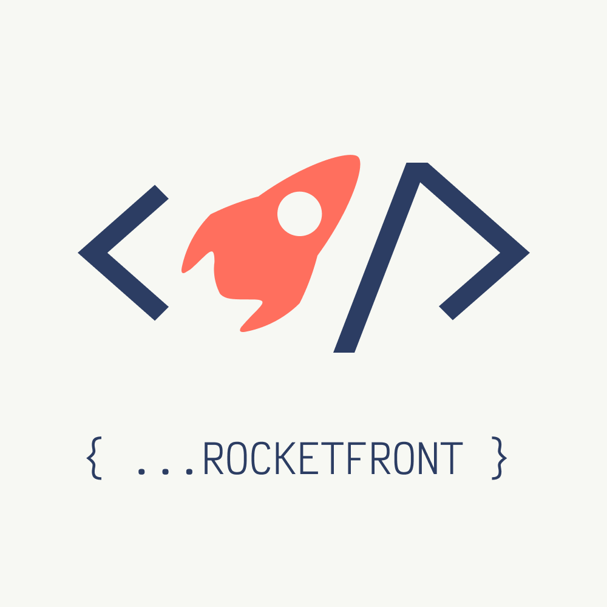

## Rocketfront - шаблон для верстки веб-сайтов Ракетной Фирмы с использованием удобных инструментов для разработки интерфесов.



#### Установить данный шаблон вы можете склонировав его с данного репозитория следующей командой

```
$ git clone git@gitlab.com:rocketfirm/rocketfront-simple.git
```

#### Так же при помощи генератора шаблонов Ракетной фирмы - [Rocketplate](https://www.npmjs.com/package/rocketplate)

```
$ rocketplate
```

после выбрать из списка: Simple-new

---

### Основные команды шаблона:

```
$ yarn serve или $ npm run serve
```

Для запуска проекта на локальном сервере (желательно использовать yarn или npm для запуска, не gulp)

```
$ yarn build или $ npm run build
```

Для сборки проекта: компиляция njk в html, транспайл js в поддерживаемый браузером js, компиляция scss в css

```
$ yarn web или $ npm run web
```

Для запуска собранного проекта на локальном сервере

```
$ yarn build:docs или $ npm run build:docs
```

Для генерации документации проекта при помощи JSDoc

```
$ yarn serve:docs или $ npm run serve:docs
```

Для запуска сгенерированной документации проекта

---

Также, данный шаблон имеет команды:

```
$ yarn create-page или $ npm run create-page
```

для создания новой страницы. Данная команда создает js/ts, scss, njk файлы в проекте, и добавляет js файл в entry для Webpack-а, а scss файл в main.scss

```
$ yarn init-vue или $ npm run init-vue
```

для инеграции Vue.js с проектом. Данная команда добавляет Vue.js в зависимости проекта, и добавляет конфигурации Vue для Webpack

```
$ yarn create-plugin или $ npm run create-plugin
```

для создания шаблонного JS/TS файла для плагинов, в файле прописан шаблон фабричной функций

```
$ yarn create-component или $ npm run create-component
```

для создания нового компонента, после ввода команды можно выбрать какие файлы нужно создать - SCSS, NJK, JS/TS или все файлы. Созданный scss файл сразу же подключается в main.scss

---

Структура шаблона:\
|/frontend\
|->/fonts\
|->/images\
|->|->/assets\
|->|->/icons\
|->|->/svg\
|->/scripts\
|->|->/components\
|->|->/libs\
|->|->/pages\
|->|->/plugins\
|->|->index.js\
|->/styles\
|->|->/blocks\
|->|->/components\
|->|->/modules\
|->|->/pages\
|->|->main.scss\
|->/views\
|->|->/\_blocks\
|->|->/\_components\
|->|->/\_partials\
|->|->/layouts\
|->|->index.njk\
|/web

---

Инструменты и технологий, которые использует данный шаблон:

- Nunjucks - шаблонизатор .html
- SASS - пре-процессор .css, в шаблоне используется .scss синтаксис
- svg-sprites - компиляция .svg изображений в спрайт
- Gulp - сборщик проектов, при помощи данного сборщика входные файлы шаблонизаторов и пре-процессоров компилируется в валидные .html и .css файлы
- Webpack - сборщик проекта, используется конкретно для сборки JavaScript модулей
- Babel - транспайлер .js кода под поддерживаемые стандарты большинства браузеров
- ESLint - линтер .js кода
- Prettier - инструмент для форматирования кода
- JSDoc - инструмент для документирования кода, и генерации документации
- TypeScript - компилятор typescript, который позволяет использовать данный язык в проекте
- Vue.js (опционально) - при желаний, при помощи CLI команды можно добавить фреймворк в проект
- и другие вспомогательные инструменты для комфортной разработки.
